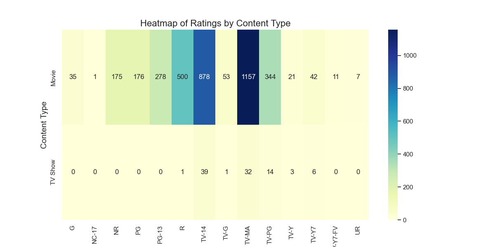
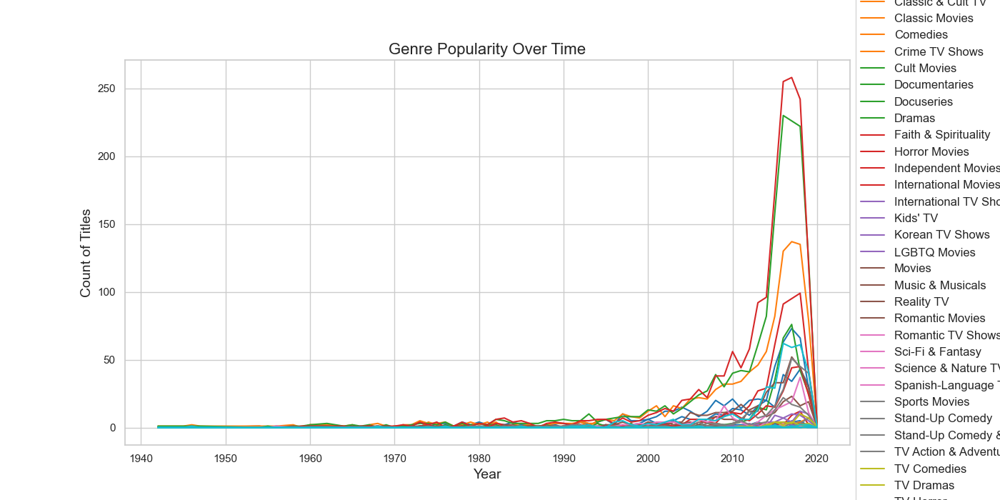
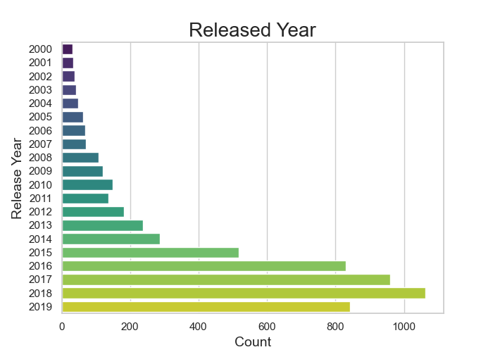
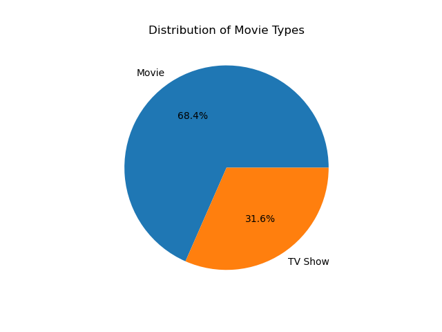
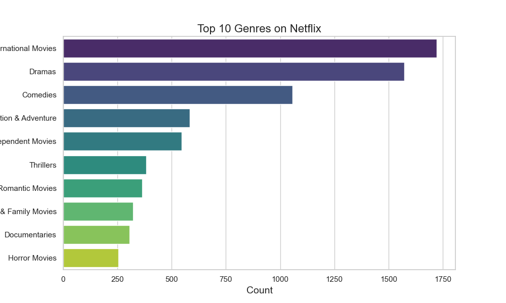
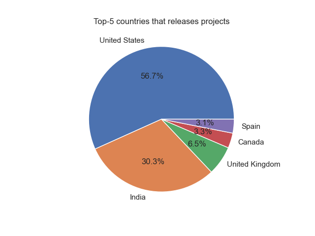
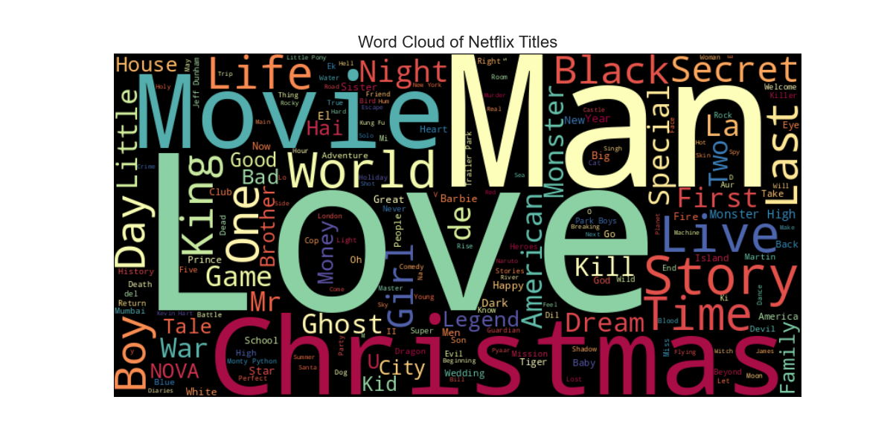
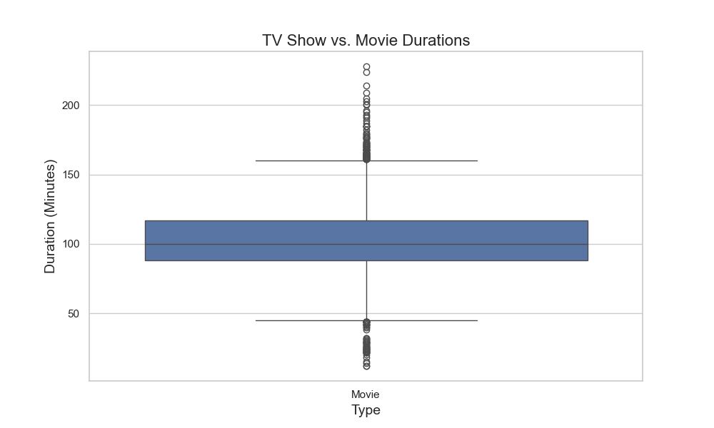

Here is a detailed **`README.md`** for your **Exploring Netflix Data Analysis and Prediction** project that includes the usage examples for each of the figures present in your project folder.

---

# Exploring Netflix Data Analysis and Prediction

This repository presents a comprehensive analysis of Netflix's content, exploring various attributes such as content types, genres, countries, release years, ratings, and durations. Additionally, visualizations like bar charts, pie charts, word clouds, and heatmaps help illustrate insights from the data.

## Project Structure

The project folder contains the following key components:

- **`EDA__Netflix__project.ipynb.html`**: An HTML version of the Jupyter Notebook containing detailed analysis and visualizations.
- **`netflix_titles.csv`**: The raw dataset containing Netflix titles, including attributes such as genre, type, release year, country, and more.
- **Figures**:
  - **`rating_by_content_type_heatmap.png`**
  - **`genre_popularity_over_time.png`**
  - **`release_year_distribution.png`**
  - **`movie_type_distribution.png`**
  - **`top_10_genres_netflix.png`**
  - **`top_5_countries_pie_chart.png`**
  - **`netflix_titles_wordcloud.png`**
  - **`tv_show_vs_movie_durations.png`**

## Technologies Used

- **Python** (For data analysis and visualization)
- **Pandas** (Data manipulation and analysis)
- **Matplotlib** (Plotting and data visualization)
- **Seaborn** (For statistical plots and enhanced visualizations)
- **WordCloud** (For generating word clouds from content titles)
- **Scikit-learn** (For machine learning models, regression, and evaluation)
- **Jupyter Notebook** (For interactive analysis)

## Visualizations

Below are descriptions of each visualization and its usage example:

### 1. **Rating by Content Type Heatmap**

**Figure**: `rating_by_content_type_heatmap.png`

**Description**: This heatmap visualizes the distribution of ratings for different content types (Movies and TV Shows). It helps understand how ratings are distributed across these two types.

**Usage**:
```python
plt.figure(figsize=(12, 6))
sns.heatmap(rating_by_type, cmap='YlGnBu', annot=True, fmt='d')
plt.title('Heatmap of Ratings by Content Type', fontsize=16)
plt.xlabel('Rating', fontsize=14)
plt.ylabel('Content Type', fontsize=14)
plt.show()
```

**Image Preview**:  


---

### 2. **Genre Popularity Over Time**

**Figure**: `genre_popularity_over_time.png`

**Description**: This line plot shows the trend of genre popularity over time, highlighting how different genres have gained or lost prominence across the years.

**Usage**:
```python
genre_by_year.plot(kind='line', figsize=(14, 7), colormap='tab10')
plt.title('Genre Popularity Over Time', fontsize=16)
plt.xlabel('Year', fontsize=14)
plt.ylabel('Count of Titles', fontsize=14)
plt.legend(title='Genres', loc='center left', bbox_to_anchor=(1, 0.5), fontsize=12)
plt.subplots_adjust(right=0.85)
plt.show()
```

**Image Preview**:  


---

### 3. **Release Year Distribution**

**Figure**: `release_year_distribution.png`

**Description**: This plot displays the distribution of Netflix content based on the release year. It shows how the content's release has evolved over the years.

**Usage**:
```python
plt.figure(figsize=(10, 6))
sns.countplot(x='release_year', data=netflix)
plt.title('Distribution of Content by Release Year', fontsize=16)
plt.xlabel('Release Year', fontsize=14)
plt.ylabel('Count of Titles', fontsize=14)
plt.show()
```

**Image Preview**:  


---

### 4. **Movie Type Distribution**

**Figure**: `movie_type_distribution.png`

**Description**: This pie chart visualizes the distribution of Movies and TV Shows available on Netflix, indicating the proportion of each type.

**Usage**:
```python
plt.pie(type_counts, labels=type_counts.index, autopct=lambda x: f"{x:.1f}%")
plt.title("Distribution of Movie Types")
plt.show()
```

**Image Preview**:  


---

### 5. **Top 10 Genres on Netflix**

**Figure**: `top_10_genres_netflix.png`

**Description**: This bar plot shows the top 10 most popular genres on Netflix, based on the frequency of titles associated with each genre.

**Usage**:
```python
plt.figure(figsize=(10, 6))
sns.barplot(x=genre_counts.values, y=genre_counts.index, hue=genre_counts.index, palette='viridis', dodge=False)
plt.title('Top 10 Genres on Netflix', fontsize=16)
plt.xlabel('Count', fontsize=14)
plt.ylabel('Genres', fontsize=14)
plt.show()
```

**Image Preview**:  


---

### 6. **Top 5 Countries Producing Content**

**Figure**: `top_5_countries_pie_chart.png`

**Description**: This pie chart visualizes the top 5 countries that produce content for Netflix, based on the number of titles available from each country.

**Usage**:
```python
plt.pie(netflix["country"].value_counts()[:5], labels=netflix["country"].value_counts().index[:5], autopct=lambda x:f"{x:.1f}%")
plt.title("Top-5 Countries that Release Projects")
plt.show()
```

**Image Preview**:  


---

### 7. **Word Cloud of Netflix Titles**

**Figure**: `netflix_titles_wordcloud.png`

**Description**: A word cloud that visualizes the most common words in Netflix titles, providing a quick overview of popular themes in content names.

**Usage**:
```python
title_words = ' '.join(netflix['title'].dropna())
wordcloud = WordCloud(width=800, height=400, background_color='black', colormap='Spectral').generate(title_words)
plt.figure(figsize=(12, 6))
plt.imshow(wordcloud, interpolation='bilinear')
plt.axis('off')
plt.title('Word Cloud of Netflix Titles', fontsize=16)
plt.show()
```

**Image Preview**:  


---

### 8. **TV Show vs. Movie Durations**

**Figure**: `tv_show_vs_movie_durations.png`

**Description**: This boxplot compares the durations of TV Shows and Movies, highlighting the difference in length between these two content types.

**Usage**:
```python
plt.figure(figsize=(10, 6))
sns.boxplot(x='type', y='duration', data=netflix[netflix['duration'].str.contains('min')].assign(duration=lambda x: x['duration'].str.replace(' min', '').astype(int)))
plt.title('TV Show vs. Movie Durations', fontsize=16)
plt.xlabel('Type', fontsize=14)
plt.ylabel('Duration (Minutes)', fontsize=14)
plt.show()
```

**Image Preview**:  


---

## How to Use

### Clone the repository
To begin working with this project, clone the repository:

```bash
git clone https://github.com/zafariabbas68/Exploring-Netflix-Data-Analysis-and-Prediction.git
```

### Install dependencies
Install the necessary Python dependencies:

```bash
pip install -r requirements.txt
```

### Run the Analysis
You can run the Jupyter notebooks for interactive analysis and visualization:

```bash
jupyter notebook
```

Alternatively, run individual Python scripts in your terminal to generate specific visualizations or perform machine learning tasks.

## License

This project is licensed under the MIT License - see the [LICENSE](LICENSE) file for details.

---

This **`README.md`** provides clear explanations of the contents of your project, visualizations, and their usage, which will help users understand and navigate your project easily.
